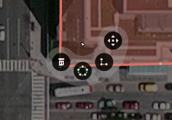

## iD Architecture

iD is written in a modular code style using ES6 modules. The modules are bundled
with [rollup.js](http://rollupjs.org/). iD eventually aims to be a reusable,
modular library to kickstart other JavaScript-based tools for OpenStreetMap.

### d3

[d3](http://d3js.org/) is the primary library used by iD. It is used for
rendering the map data as well as many sorts of general DOM manipulation tasks
for which jQuery would often be used.

Notable features of d3 that are used by iD include
[d3.fetch](https://github.com/d3/d3/blob/main/API.md#fetches-d3-fetch), which is
used to make the API requests to download data from openstreetmap.org and save changes;
[d3.dispatch](https://github.com/d3/d3/blob/main/API.md#dispatches-d3-dispatch),
which provides a callback-based [Observer
pattern](https://en.wikipedia.org/wiki/Observer_pattern) between different
parts of iD;
[d3.geoPath](https://github.com/d3/d3/blob/main/API.md#paths), which
generates SVG paths for lines and areas; and
[d3.zoom](https://github.com/d3/d3/blob/main/API.md#zooming-d3-zoom),
which implements map panning and zooming.


### Core Module

The iD *core* module implements the basic datastructures needed to support
browser-based editing:

* `iD.coreContext` - container for all iD "global" objects and bootstrap code
* `iD.coreGraph` - graph of objects and their relationships to one another
* `iD.coreHistory` - undo/redo history for changes made during editing
* `iD.coreDifference` - efficiently determine the difference between two graphs
* `iD.coreTree` - performs fast spatial indexing of the loaded objects

### OSM Module

The iD *osm* module includes classes which represent the basic OpenStreetMap
objects: nodes, ways, and relations.

* `iD.osmNode` - a _node_ is a point type, having a single geographic coordinate
* `iD.osmWay` - a _way_ is an ordered list of nodes
* `iD.osmRelation` - a _relation_ groups together nodes, ways, and other relations to provide
  free-form higher-level structures.

Each of these three types has _tags_: an associative array of key-value pairs which
describe the object.

* `iD.osmEntity` - common base class for `iD.osmNode`, `iD.osmWay`, `iD.osmRelation`

These three classes inherit from a common base, `iD.osmEntity`.
This is the only use of classical inheritance in iD, but it's justified
by the common functionality of the types. Generically, we refer to a
node, way or relation as an _entity_.

Every entity has a unique numeric `id`. By convention, positive numbers are
assigned by the OSM database for saved features, and negative numbers are
assigned by the iD editor for local newly-created objects.

`id` values from the OSM database as treated as opaque strings; no
[assumptions](https://lists.openstreetmap.org/pipermail/dev/2013-February/026495.html)
are made of them other than that they can be compared for identity and do not
begin with a minus sign (and thus will not conflict with local `id` values).
The three types of entities have separate `id` spaces: a node can have the
same numeric `id` as a way or a relation. Instead of segregating ways, nodes,
and other entities into different datastructures, iD internally uses fully-unique
`id` values generated by prefixing each OSM ID with the first letter of the entity
type. For example, a way with OSM `id` `123456` is represented as `w123456`
within iD.

iD entities are *immutable*: once constructed, an `Entity` object cannot
change. Tags cannot be updated; nodes cannot be added or removed from ways,
and so on. Immutability makes it easier to reason about the behavior of an
entity: if your code has a reference to one, it is safe to store it and use it
later, knowing that it cannot have been changed outside of your control. It
also makes it possible to implement the entity graph (described below) as an
efficient [persistent data
structure](https://en.wikipedia.org/wiki/Persistent_data_structure).

Since iD is an editor, it must allow for new versions of entities. The
solution is that all edits produce new copies of anything that changes. At the
entity level, this takes the form of methods such as `iD.osmNode#move`, which
returns a new node object that has the same `id` and `tags` as the original, but a
different `loc` coordinate. More generically, `iD.osmEntity#update` returns
a new entity of the same type and `id` as the original but with specified properties
such as `nodes`, `tags`, or `members` replaced.


Entities are related to one another: ways have many nodes and relations have
many members.

The osm module also includes code related to special kinds of objects in OpenStreetMap.

* `iD.osmIntersection` - code for working with turn restrictions
* `iD.osmLanes` - code for working with traffic and turn lanes
* `iD.osmMultipolygon` - code for working with multipolygon relations


### Editing OSM

To render a map of a certain area, iD needs a
datastructure to hold all the entities in that area and traverse these
relationships. `iD.coreGraph` provides this functionality. The core of a graph is
a map between `id`s and the associated entities; given an `id`, the graph can give
you the entity. Like entities, a graph is immutable: adding, replacing, or
removing an entity produces a new graph, and the original is unchanged.
Because entities are immutable, the original and new graphs can minimize
memory use by sharing references to entities that have not changed instead of
copying the entire graph.
This persistent data structure approach is similar to the internals of
the [git](http://git-scm.com/) revision control system.

The final major component of the core is `iD.coreHistory`, which tracks the changes
made in an editing session and provides undo/redo capabilities. Here, the
immutable nature of the core types really pays off: the history is a simple
stack of graphs, each representing the state of the data at a particular point
in editing. The graph at the top of the stack is the current state, off which
all rendering is based. To undo the last change, this graph is popped off the
stack, and the map is re-rendered based on the new top of the stack.

This approach constitutes one of the main differences between iD's approach
to data and that of [JOSM](https://josm.openstreetmap.de/) and
[Potlatch 2](https://wiki.openstreetmap.org/wiki/Potlatch_2).
Instead of changing a single copy of local data and having to implement
an 'undo' for each specific action, actions in iD do not need to be aware
of history and the undo system.

Finally, we have the auxiliary classes `iD.coreDifference` and `iD.coreTree`.

`iD.coreDifference` encapsulates the difference between two graphs, and knows how to calculate the
set of entities that were created, modified, or deleted, and need to be redrawn.

```js
var a = iD.coreGraph(), b = iD.coreGraph();
// (fill a & b with data)
var difference = iD.coreDifference(a, b);

// returns entities created between a and b
difference.created();
```

`iD.coreTree` calculates the set of downloaded entities that are visible in the
current map view. To calculate this quickly during map
interaction, it uses an [R-tree](https://en.wikipedia.org/wiki/R-tree).

```js
var graph = iD.coreGraph();
// (load OSM data into graph)

// this tree indexes the contents of the graph
var tree = iD.coreTree(graph);

// quickly pull all features that intersect with an extent
var features = tree.intersects(
    iD.geoExtent([0, 0], [2, 2]), tree.graph());
```

### Actions Module

In iD, an _action_ is a function that accepts a graph as input and returns a
new, modified graph as output. Actions typically need other inputs as well; for
example, `iD.actionDeleteNode` also requires the `id` of a node to delete. The
additional input is passed to the action's constructor:

```js
// construct the action: this returns a function that remembers the
// value `n123456` in a closure so that when it's called, it runs
// the specified action on the graph
var action = iD.actionDeleteNode('n123456');

// apply the action, yielding a new graph. oldGraph is untouched.
newGraph = action(oldGraph);
```

iD provides actions for all the typical things an editor needs to do: add a
new entity, split a way in two, connect the vertices of two ways together, and
so on. In addition to performing the basic work needed to accomplish these
things, an action typically contains a significant amount of logic for keeping
the relationships between entities logical and consistent. For example, an
action as apparently simple as `DeleteNode`, in addition to removing the node
from the graph, needs to do two other things: remove the node from any ways in
which it is a member (which in turn requires deleting parent ways that are
left with just a single node), and removing it from any relations of which it
is a member.

As you can imagine, implementing all these details requires an expert
knowledge of the OpenStreetMap data model. It is our hope that JavaScript
based tools for OpenStreetMap can reuse the iD's core implementation,
significantly reducing the work necessary to create a robust tool.

### Modes Module

With _modes_, we shift gears from abstract data types and algorithms to the
parts of the architecture that implement the user interface for iD. Modes are
manifested in the interface by the three buttons at the top left:


The modality of existing OSM editors runs the gamut from Potlatch 2, which is
almost entirely modeless, to JOSM, which sports half a dozen modes out of the
box and has many more provided by plugins. iD seeks a middle ground: too few
modes can leave new users unsure where to start, while too many can be
overwhelming.

iD's user-facing modes consist of a base "Browse" mode, in which you can move
around the map and select and edit entities, and three geometrically-oriented
drawing modes, which are accessible through the mode buttons in the upper
toolbar: Point, Line, and Area. In the code, these are broken down a
little bit more. There are separate modes for when an entity is selected
(`iD.modeSelect`) versus when nothing is selected (`iD.modeBrowse`), and
each of the geometric modes is split into one mode for starting to draw an
object and one mode for continuing an existing object (with the exception of
`iD.modeAddPoint`, which is a single-step operation for obvious reasons).

The code interface for each mode consists of a pair of methods: `enter` and
`exit`. In the `enter` method, a mode sets up all the behavior that should be
present when that mode is active. This typically means binding callbacks to
DOM events that will be triggered on map elements, installing keybindings, and
showing certain parts of the interface like the inspector in `Select` mode.
The `exit` mode does the opposite, removing the behavior installed by the
`enter` method. Together the two methods ensure that modes are self-contained
and exclusive: each mode knows exactly the behavior that is specific to that
mode, and exactly one mode's behavior is active at any time.

### Behavior Module

Certain behaviors are common to more than one mode. For example, iD indicates
interactive map elements by drawing a halo around them when you hover over
them, and this behavior is common to both the browse and draw modes. Instead
of duplicating the code to implement this behavior in all these modes, we
extract it to `iD.behaviorHover`.

_Behaviors_ take their inspiration from [d3's
behaviors](https://github.com/d3/d3/blob/main/API.md). Like d3's `zoom`
and `drag`, each iD behavior is a function that takes as input a d3 selection
(assumed to consist of a single element) and installs the DOM event bindings
necessary to implement the behavior. The `Hover` behavior, for example,
installs bindings for the `mouseover` and `mouseout` events that add and
remove a `hover` class from map elements.

Because certain behaviors are appropriate to some but not all modes, we need
the ability to remove a behavior when entering a mode where it is not
appropriate. (This is functionality [not yet
provided](https://github.com/mbostock/d3/issues/894) by d3's own behaviors.)
Each behavior implements an `off` function that "uninstalls" the behavior.
This is very similar to the `exit` method of a mode, and in fact many modes do
little else but uninstall behaviors in their `exit` methods.

### Operations Module

_Operations_ wrap actions, providing their user-interface: tooltips, key
bindings, and the logic that determines whether an action can be validly
performed given the current map state and selection. Each operation is
constructed with the list of `id`s which are currently selected and a `context`
object which provides access to the history and other important parts of iD's
internal state. After being constructed, an operation can be queried as to
whether or not it should be made available (i.e., show up in the context menu)
and if so, if it should be enabled.



We make a distinction between availability and enabled state for the sake of
learnability: most operations are available so long as an entity of the
appropriate type is selected. Even if it remains disabled for other reasons
(e.g. because you can't split a way on its start or end vertex), a new user
can still learn that "this is something I can do to this type of thing", and a
tooltip can provide an explanation of what that operation does and the
conditions under which it is enabled.

To execute an operation, call it as a function, with no arguments. The typical
operation will perform the appropriate action, creating a new undo state in
the history, and then enter the appropriate mode. For example,
`iD.operationSplit` performs `iD.actionSplit`, then enters
`iD.modeSelect` with the resulting ways selected.

### Renderer and SVG Modules

Finally, we get to the parts of iD that actually draw and manipulate the map
entities on screen. The rendering is coordinated by `iD.rendererMap`, which
takes care of setting up a [Spherical Mercator](https://bl.ocks.org/mbostock/3757132)
projection and the [zoom
behavior](https://github.com/mbostock/d3/wiki/Zoom-Behavior), and provides
accessors for such things as the current zoom level and map center.

For rendering entities on screen, we found it convenient to adopt a geometric
vocabulary that provides a slightly higher-level representation than the basic
entity types of the OSM data model:

* A _point_ is a node that is not a member of any way.
* A _vertex_ is a node that is a member of one or more ways.
* A _line_ is a way that is not an area.
* An _area_ is a way that is circular and has certain tags, or a series of one
  or more ways grouped in a multipolygon relation.

For each of these geometric types, `iD.svg` has a corresponding module:
`iD.svgPoints`, `iD.svgVertices`, `iD.svgLines`, and `iD.svgAreas`. To
render entities on screen, `iD.rendererMap` delegates to these modules. Internally,
they make heavy use of [d3 joins](https://bost.ocks.org/mike/join/) to
manipulate the SVG elements that visually represent the map entities. When an
entity is rendered for the first time, it is part of the _enter_ selection,
and the SVG elements needed to represent it are created. When an entity is
modified, it is part of the _update_ selection, and the appropriate attributes
of the SVG element (for example, those that specify the location on screen)
are updated. And when an entity is deleted (or simply moves offscreen), the
corresponding SVG element is in the _exit_ selection, and will be removed.

The `iD.svg` modules apply classes to the SVG elements based on the entity
tags, via `iD.svgTagClasses`. For example, an entity tagged with
`highway=residential` gets two classes: `tag-highway` and
`tag-highway-residential`. This allows distinct visual styles to be applied
via CSS at either the key or key-value levels. SVG elements also receive a
class corresponding to their entity type (`node`, `way`, or `relation`) and
one corresponding to their geometry type (`point`, `line`, or `area`).

The `iD.svg` module has a few other submodules that don't have a one-to-one
correspondence with entities:

* `iD.svgMidpoints` - draws the small "virtual node" at the midpoint between
  two vertices.
* `iD.svgLabels` - draws textual labels
* `iD.svgLayers` - sets up a number of layers that ensure that map elements
  appear in an appropriate z-order.
* `iD.svgOsm` - sets up the OSM-specific data layers
* `iD.svgData` - draws any other overlaid vector data (gpx, kml, geojson, mvt, pbf)
* `iD.svgDebug` - draws debugging information

### Other UI

iD provides a lot of user interface elements other than the core map component:
the page footer, the interface for saving changes, the splash screen you see
the first time you use iD, the map controls, and the tag/preset editor, for example.

The implementations for all non-map UI components live in the `iD.ui` module.
Many of the submodules under the `ui` module follow a pattern for reusable d3
components [originally suggested](https://bost.ocks.org/mike/chart/) by Mike
Bostock in the context of charts. The entry point to a UI element is a
constructor function, e.g. `iD.uiViewOnOSM()`. The constructor function may
require a set of mandatory arguments; for most UI components exactly one
argument is required, a `context`.

The constructor function returns a draw function which accepts a d3 selection.
Drawing is then accomplished with
[d3.selection#call](https://github.com/d3/d3-selection/blob/main/README.md#selection_call):

```js
    footer = footer.enter()
        .append('div')
        .attr('class', 'footer')
        .merge(footer);

    footer
        .call(uiViewOnOSM(context).what(entity));
```

Some components are reconfigurable, and some provide functionality beyond
basic rendering. Both reconfiguration and extended functionality are exposed
via module functions:

```js
var inspector = iD.uiInspector();
inspector(container); // render the inspector
inspector.tags(); // retrieve the current tags
inspector.on('change', callback); // get notified when a tag change is made
```

### Validation Module

Runtime data validation in iD is managed by `coreValidator`.

#### Issue Severities

"Issue" is the general term for anything noted by the validator. Issues are further categorized by severity.

##### `error`

_Red._ Errors are the most severe issues. The user must resolve all errors before uploading their changes. Thus, these should be straightforward to fix and there should be virtually no false positives.

##### `warning`

_Yellow._ Warnings are general issues that the user is free to ignore. They have varying degrees of importance, accuracy, and fixability. Still, only clear and relevant warnings should be shown to avoid overwhelming the user. Most issues are warnings.

#### Validation Rules

A validation rule is an object that takes an entity and a graph and returns objects of type `validationIssue` representing problems found with that entity for that graph. Rules are listed under `modules/validations` and correspond directly to the toggleable Rules list under the Issues pane in iD's UI.

Each `validationIssue` takes its rule's `type` and may include a `subtype` that further differentiates it.

#### Issue Types

##### `almost_junction`

A way ends close to another way, indicating they should likely be connected. The current distance threshold is 5 meters.

* `highway-highway`: both the ways are roads or paths; no issue is flagged if the endpoint is an entrance or is tagged `noexit=yes`

##### `close_nodes`

Two nodes have a very small distance between them. The threshold distance is smaller for features expected to be mapped at higher levels of detail (e.g. paths, rooms).

* `detached`: the nodes are not part of any ways; close points with differing z-axis tags like `layer` and `level` are not flagged
* `vertices`: the nodes are adjacent members of a way

##### `crossing_ways`

Two ways cross without a junction node or enough information to clarify how they cross.

Building crossings are flagged per-feature. Other subtypes are flagged per-crossing.

* `building-building`
* `building-highway`
* `building-railway`
* `building-waterway`
* `highway-highway`
* `highway-railway`
* `highway-waterway`
* `railway-railway`
* `railway-waterway`
* `waterway-waterway`

##### `disconnected_way`

One or more interconnected, routable feature are not connected to the rest of the routable network (i.e. they form a routing island). A way is considered connected to the network if any of its nodes are on an unloaded tile, meaning large routing islands may not always be detected.

* `highway`: the feature is a road, path, ferry route, or elevator; entrances are also considered network connections

##### `help_request`

Someone has indicated a feature needs further attention.

* `fixme_tag`: a feature has a `fixme` tag that existed before the user's current edits; deleting the `fixme` tag marks the issue as resolved regardless of the user's other edits

##### `impossible_oneway`

A one-way line does not have a valid connection at its first or last node.

* `highway`: a one-way road or path does not start or end at another highway or an entrance
* `waterway`: multiple streams, etc., start or end at the same node that's not a spring, drain, or water body

##### `incompatible_source`

The `source` tag of a feature references a data source known to have a license incompatible with OpenStreetMap. This is very much not exhaustive and currently only flags sources containing "google".

##### `invalid_format`

A tag of a feature has an unexpected syntax.

* `email`: the `email` tag does not look like "user@example.com"

##### `maprules`

An issue with the active [MapRules](https://github.com/radiant-maxar/maprules) validation rules.

##### `mismatched_geometry`

A feature's tags indicate it should have a different geometry than it currently does.

* `area_as_line`: an unclosed way has tags implying it should be a closed area (e.g. `area=yes` or `building=yes`)
* `area_as_point`
* `area_as_vertex`
* `line_as_area`
* `line_as_point`
* `line_as_vertex`: a detached node has tags implying it should be a line (e.g. `highway=motorway`)
* `point_as_area`
* `point_as_line`
* `point_as_vertex`: a vertex node has tags implying it should be detached from ways (e.g. `amenity=cafe`)
* `vertex_as_area`
* `vertex_as_line`
* `vertex_as_point`: a detached node has tags implying it should be attached to a way (e.g. `highway=stop`)
* `unclosed_multipolygon_part`: a relation is tagged as a multipolygon but not all of its member ways form closed rings

##### `missing_role`

A relation membership does not have a set `role`.

##### `missing_tag`

A feature does not have enough tags to define what it is.

* `any`: there are zero tags
* `descriptive`: there are `area`, `name`, `type=multipolygon`, and/or meta tags (e.g. `source`), but no defining tags
* `relation_type`: the OSM entity type is `relation` but there is no `type` tag
* `highway_classification`: the OSM entity type is `way` and the feature is tagged as `highway=road`

##### `outdated_tags`

A feature has nonstandard tags.

* `deprecated_tags`: the feature has tags that should be replaced or removed, as specified in `deprecated.json` or the `replacement` property of a preset
* `incomplete_tags`: the feature has tags that indicate it should also have some other tags
* `noncanonical_brand`: the feature indicates it should match a name-suggestion-index entry but does not have all of the given tags
* `old_multipolygon`: the feature is a multipolygon relation with its defining tags set on its outer member way

##### `private_data`

An email address, phone number, or fax number is present on a residential feature that isn't also tagged as a POI.

##### `suspicious_name`

There's indication that a `name` tag doesn't contain the actual name of the feature. Multilingual names like `name:de` are also checked.

* `generic_name`: a name matches the raw key or value of the feature's defining tags (e.g. `amenity`, `cafe`) or it matches something the name-suggestion-index discards as generic when checking the most common place names in OpenStreetMap
* `not_name`: a name tag matches a value under the `not:name` tag

##### `unsquare_way`

A way has corners close to, but not quite 90°. The user can vary the "close to" degree threshold between 0° and 20°. The default is 5°. Only buildings are currently flagged.

* `building`: the feature has a `building` tag

#### Issue Changeset Tags

To assist data reviewers, tags indicating the number and type of issues created and resolved via the user's edits are included in the changeset tags.

These counts are tied to issues and not features, so edits to a single feature could both create and resolve issues while leaving still others unchanged.

These tags cannot be manually removed or altered by the user—for example, by disabling rules or ignoring issues. One exception to this is that the user can change the `unsquare_way` degree threshold.

The format is: `{warnings|resolved}:{type}:{subtype}={count}`

Note that specific `type` and `subtype` IDs could change or vary slightly in meaning between different versions of iD.

##### `warnings`

The `warnings` namespace indicates issues that were created and ignored by the user. These must all be issues of severity `warning` and not `error` since errors block upload altogether and thus cannot be ignored.

Prior to iD 2.16.0, these also included any warnings concerning features edited by the user, even if they weren't created via the user's edits.

e.g. `warnings:disconnected_way:highway=4`

##### `resolved`

The `resolved` namespace indicates issues of any kind that were fixed by the user. A resolved issue did not necessarily appear under `warnings` in some previous OSM changeset.

e.g. `resolved:crossing_ways:building-highway=2`
